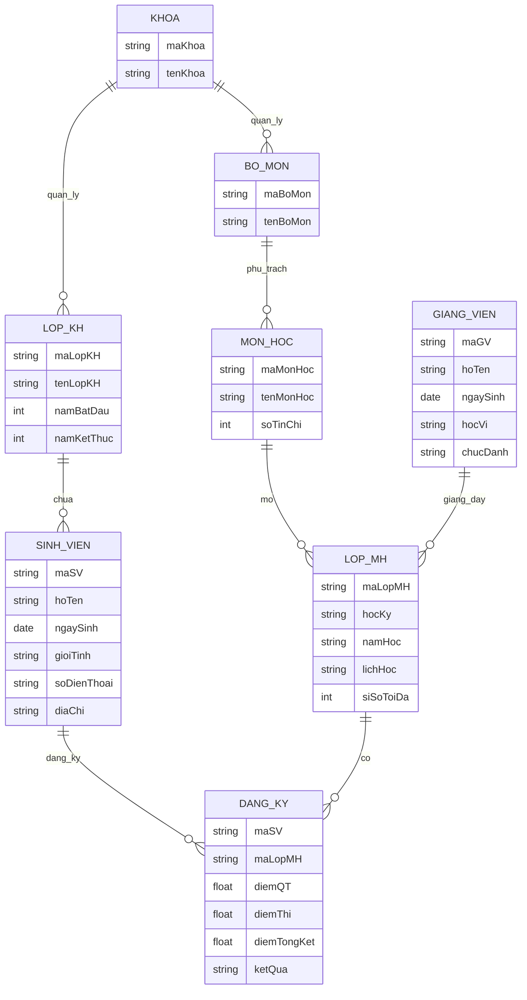

```mermaid
erDiagram
  KHOA ||--o{ BO_MON : quan_ly
  KHOA ||--o{ LOP_KH : quan_ly
  BO_MON ||--o{ MON_HOC : phu_trach

  LOP_KH ||--o{ SINH_VIEN : chua

  MON_HOC ||--o{ LOP_MH : mo
  GIANG_VIEN ||--o{ LOP_MH : giang_day

  SINH_VIEN ||--o{ DANG_KY : dang_ky
  LOP_MH ||--o{ DANG_KY : co

    KHOA {
        string maKhoa
        string tenKhoa
    }

    BO_MON {
        string maBoMon
        string tenBoMon
    }

    MON_HOC {
        string maMonHoc
        string tenMonHoc
        int soTinChi
    }

    LOP_KH {
        string maLopKH
        string tenLopKH
        int namBatDau
        int namKetThuc
    }

    SINH_VIEN {
        string maSV
        string hoTen
        date ngaySinh
        string gioiTinh
        string soDienThoai
        string diaChi
    }

    GIANG_VIEN {
        string maGV
        string hoTen
        date ngaySinh
        string hocVi
        string chucDanh
    }

    LOP_MH {
        string maLopMH
        string hocKy
        string namHoc
        string lichHoc
        int siSoToiDa
    }
    DANG_KY {
        string maSV
        string maLopMH
        float diemQT
        float diemThi
        float diemTongKet
        string ketQua
    }
```
