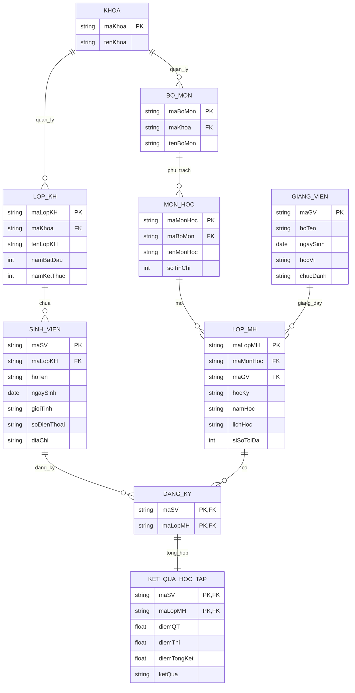

```mermaid
  erDiagram
    KHOA ||--o{ BO_MON : quan_ly
    KHOA ||--o{ LOP_KH : quan_ly
    BO_MON ||--o{ MON_HOC : phu_trach
    LOP_KH ||--o{ SINH_VIEN : chua
    MON_HOC ||--o{ LOP_MH : mo
    GIANG_VIEN ||--o{ LOP_MH : giang_day
    SINH_VIEN ||--o{ DANG_KY : dang_ky
    LOP_MH ||--o{ DANG_KY : co
    DANG_KY ||--|| KET_QUA_HOC_TAP : tong_hop

    KHOA {
        string maKhoa PK
        string tenKhoa
    }

    BO_MON {
        string maBoMon PK
        string maKhoa FK
        string tenBoMon
    }

    LOP_KH {
        string maLopKH PK
        string maKhoa FK
        string tenLopKH
        int namBatDau
        int namKetThuc
    }

    MON_HOC {
        string maMonHoc PK
        string maBoMon FK
        string tenMonHoc
        int soTinChi
    }

    SINH_VIEN {
        string maSV PK
        string maLopKH FK
        string hoTen
        date ngaySinh
        string gioiTinh
        string soDienThoai
        string diaChi
    }

    GIANG_VIEN {
        string maGV PK
        string hoTen
        date ngaySinh
        string hocVi
        string chucDanh
    }

    LOP_MH {
        string maLopMH PK
        string maMonHoc FK
        string maGV FK
        string hocKy
        string namHoc
        string lichHoc
        int siSoToiDa
    }

    DANG_KY {
        string maSV PK, FK
        string maLopMH PK, FK
    }

    KET_QUA_HOC_TAP {
        string maSV PK, FK
        string maLopMH PK, FK
        float diemQT
        float diemThi
        float diemTongKet
        string ketQua
    }
```
