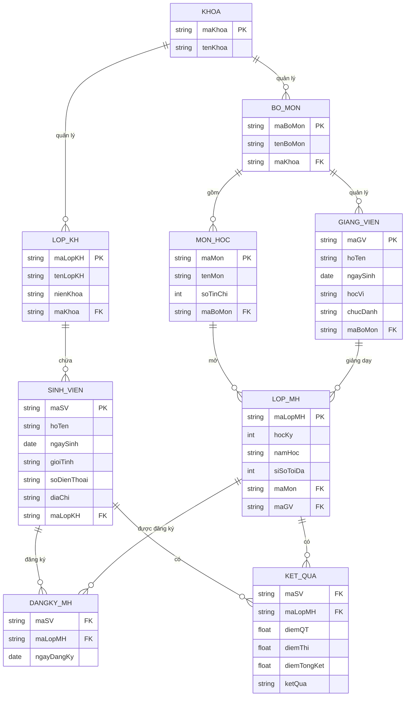

```mermaid
  erDiagram
    KHOA {
        string maKhoa PK
        string tenKhoa
    }

    BO_MON {
        string maBoMon PK
        string tenBoMon
        string maKhoa FK
    }

    MON_HOC {
        string maMon PK
        string tenMon
        int soTinChi
        string maBoMon FK
    }

    LOP_KH {
        string maLopKH PK
        string tenLopKH
        string nienKhoa
        string maKhoa FK
    }

    SINH_VIEN {
        string maSV PK
        string hoTen
        date ngaySinh
        string gioiTinh
        string soDienThoai
        string diaChi
        string maLopKH FK
    }

    GIANG_VIEN {
        string maGV PK
        string hoTen
        date ngaySinh
        string hocVi
        string chucDanh
        string maBoMon FK
    }

    LOP_MH {
        string maLopMH PK
        int hocKy
        string namHoc
        int siSoToiDa
        string maMon FK
        string maGV FK
    }

    DANGKY_MH {
        string maSV FK
        string maLopMH FK
        date ngayDangKy
    }

    KET_QUA {
        string maSV FK
        string maLopMH FK
        float diemQT
        float diemThi
        float diemTongKet
        string ketQua
    }

    %% Quan hệ
    KHOA ||--o{ BO_MON : "quản lý"
    KHOA ||--o{ LOP_KH : "quản lý"
    BO_MON ||--o{ MON_HOC : "gồm"
    BO_MON ||--o{ GIANG_VIEN : "quản lý"
    MON_HOC ||--o{ LOP_MH : "mở"
    GIANG_VIEN ||--o{ LOP_MH : "giảng dạy"
    LOP_KH ||--o{ SINH_VIEN : "chứa"
    SINH_VIEN ||--o{ DANGKY_MH : "đăng ký"
    LOP_MH ||--o{ DANGKY_MH : "được đăng ký"
    SINH_VIEN ||--o{ KET_QUA : "có"
    LOP_MH ||--o{ KET_QUA : "có"
```
